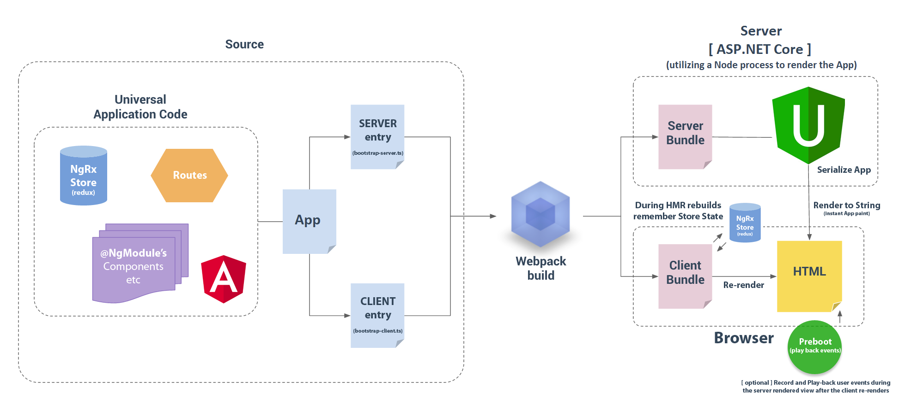

# ASP.NET Core 2.0 & Angular 4 (+) advanced starter!

> Base on https://github.com/MarkPieszak/aspnetcore-angular2-universal

<p align="center">
    
</p>

### What is this repo? Live Demo here: http://pko-web.azurewebsites.net

This repository is maintained by [Angular](https://github.com/angular/angular) and is meant to be an advanced starter 
for both ASP.NET Core 2.0 using Angular 4.0+, not only for the client-side, but to be rendered on the server for instant 
application paints (Note: If you don't need SSR [read here](#faq) on how to disable it).

This is meant to be a Feature-Rich Starter application containing all of the latest technologies, best build systems available, and include many real-world examples and libraries needed in todays Single Page Applications (SPAs).

This utilizes all the latest standards, no gulp, no bower, no typings, no manually "building" anything. NPM, Webpack and .NET handle everything for you!

# Table of Contents

* [Features](#features)
* [Getting Started](#getting-started)
* [Deployment](#deployment)
* [Upcoming Features](#upcoming-features)
* [Application Structure](#application-structure)
* [Gotchas](#gotchas)
* [FAQ](#faq---also-check-out-the-faq-issues-label)
* [Special Thanks](#special-thanks)
* [License](#license)
* [Consulting & Training](#looking-for-angular--aspnet-consulting--training--support)

---

# Features:

> These are just some of the features found in this starter!

- ASP.NET 2.0 - VS2017 15.3 support now!
  - Azure delpoyment straight from VS2017
  - Built in docker support through VS2017
  - RestAPI (WebAPI) integration
  - SQL Database CRUD demo
  - Swagger WebAPI documentation when running in development mode 
  - SignalR Chat demo! (Thanks to [@hakonamatata](https://github.com/hakonamatata))

- **Angular 4.0.0** :
  - (Minimal) Angular-CLI integration 
    - This is to be used mainly for Generating Components/Services/etc.
    - Usage examples: 
      - `ng g c components/example-component`
      - `ng g s shared/some-service`
  - Featuring Server-side rendering (Platform-Server, aka: "Universal")
	  - Faster initial paints, SEO (Search-engine optimization w Title/Meta/Link tags), social media link-previews, etc
  - i18n internationalization support (via/ ngx-translate)
  - Baked in best-practices (follows Angular style guide)
  - Bootstrap3 (with ngx-bootstrap) - (can be rendered on the server!)
    - Can be easily replaced with bootstrap4 (3 is provided for browser support)
    - Bootstrap using SCSS / SASS for easy theming / styling!

- **Webpack build system (Webpack 2)**
  - HMR : Hot Module Reloading/Replacement 
  - Production builds w/ AoT Compilation

- **Testing frameworks**
  - Unit testing with Jest (Going back to Karma soon)

- **Productivity**
  - Typescript 2
  - Codelyzer (for Real-time static code analysis) 
    - VSCode & Atom provide real-time analysis out of the box.

- **ASP.NET Core 2.0**
  
  - Integration with NodeJS to provide pre-rendering, as well as any other Node module asset you want to use.

- **Azure**
  - Microsoft Application Insights setup (for MVC & Web API routing)
  - Client-side Angular2 Application Insights integration
    - If you're using Azure simply install `npm i -S @markpieszak/ng-application-insights` as a dependencies.
    - Note: Make sure only the Browser makes these calls ([usage info here](https://github.com/MarkPieszak/angular-application-insights/blob/master/README.md#usage))
    - More information here: - https://github.com/MarkPieszak/angular-application-insights
    ```typescript
      // Add the Module to your imports 
      ApplicationInsightsModule.forRoot({
        instrumentationKey: 'Your-Application-Insights-instrumentationKey'
      })
    ```
  

> Note: Dual Auth
https://github.com/shawnwildermuth/DualAuthCore

----

----
  
# Getting Started?

- **Make sure you have at least Node 6.x or higher (w/ npm 3+) installed!**  
- **This repository uses ASP.Net Core 2.0, which has a hard requirement on .NET Core Runtime 2.0.0 and .NET Core SDK 2.0.0. Please install these items from [here](https://github.com/dotnet/core/blob/master/release-notes/download-archives/2.0.0-download.md)**

### Microsoft SQL Server 2017

Run SQL Server 2017 in Docker
```bash
./db/run-db-server.sh
```

Remove database
```bash
dotnet ef database drop
```

Add migrations
```bash
dotnet ef migrations add InitialCreate
```

Remove migrations
```bash
dotnet ef migrations remove
```

Apply migrations
```bash
dotnet ef database update
```

> Note: Documents for Entity Framework Core
https://docs.microsoft.com/en-us/ef/core/


### Visual Studio 2017

Make sure you have .NET Core 2.0 installed and/or VS2017 15.3.
VS2017 will automatically install all the neccessary npm & .NET dependencies when you open the project.

Simply push F5 to start debugging !

**Note**: If you get any errors after this such as `module not found: boot.server` (or similar), open up command line and run `npm run build:dev` to make sure all the assets have been properly built by Webpack.

### Visual Studio Code

> Note: Make sure you have the C# extension & .NET Core Debugger installed.

The project comes with the configured Launch.json files to let you just push F5 to start the project.

```bash
# cd into the directory you cloned the project into
npm install && npm run build:dev && dotnet restore
# or yarn install
```

If you're running the project from command line with `dotnet run` make sure you set your environment variables to Development (otherwise things like HMR might not work).

```bash
# on Windows:
set ASPNETCORE_ENVIRONMENT=Development
# on Mac/Linux
export ASPNETCORE_ENVIRONMENT=Development 
```

# Upcoming Features:

- Update to use npm [ngAspnetCoreEngine](https://github.com/angular/universal/pull/682) (still need to tweak a few things there)
- Potractor e2e testing
- Add basic Redux State store (Will also hold state durijg HMR builds)

----

----

# Deployment

### Dotnet publish
Using `dotnet publish`, when it's finished place the generated folder onto your server and use IIS to fire everything up.

### Heroku 
<a href="https://dashboard.heroku.com/new?template=https://github.com/MarkPieszak/aspnetcore-angular2-universal.git">

</a>

### Azure

```bash
git remote add azure https://your-user-name@my-angular2-site.scm.azurewebsites.net:443/my-angular2-site.git
                     // ^ get this from Azure (Web App Overview section - Git clone url)

git push --set-upstream azure master 
```

# Application Structure:

> Note: This application has WebAPI (our REST API) setup inside the same project, but of course all of this 
could be abstracted out into a completely separate project('s) ideally. .NET Core things are all done in the same project 
for simplicity's sake.

**Root level files** 

Here we have the *usual suspects* found at the root level.

*Front-end oriented files:*

- `package.json` - NPM project dependencies & scripts
- `.tsconfig` - TypeScript configuration (here we setup PATHs as well)
- `webpack` - configuration files (modular bundling + so much more)
- `karma` - configuration files (unit testing)
- `protractor` - config files (e2e testing)
- `tslint` - TypeScript code linting rules

### /ClientApp/ - Everything Angular 

### /Server/ - Our REST API (WebApi) - MVC Controller

> As we pointed out, these are here for simplicities sake, and realistically you may want separate projects 
for all your microservices / REST API projects / etc.

We're utilizing MVC within this application, but we only need & have ONE Controller, named `HomeController`. This is where our entire 
Angular application gets serialized into a String, sent to the Browser, along with all the assets it needs to then bootstrap on the client-side, and become a full-blown SPA afterwards.

----

# "Gotchas"

- This repository uses ASP.Net Core 2.0, which has a hard requirement on .NET Core Runtime 2.0.0 and .NET Core SDK 2.0.0. Please install these items from [here](https://github.com/dotnet/core/blob/master/release-notes/download-archives/2.0.0-download.md)

----
